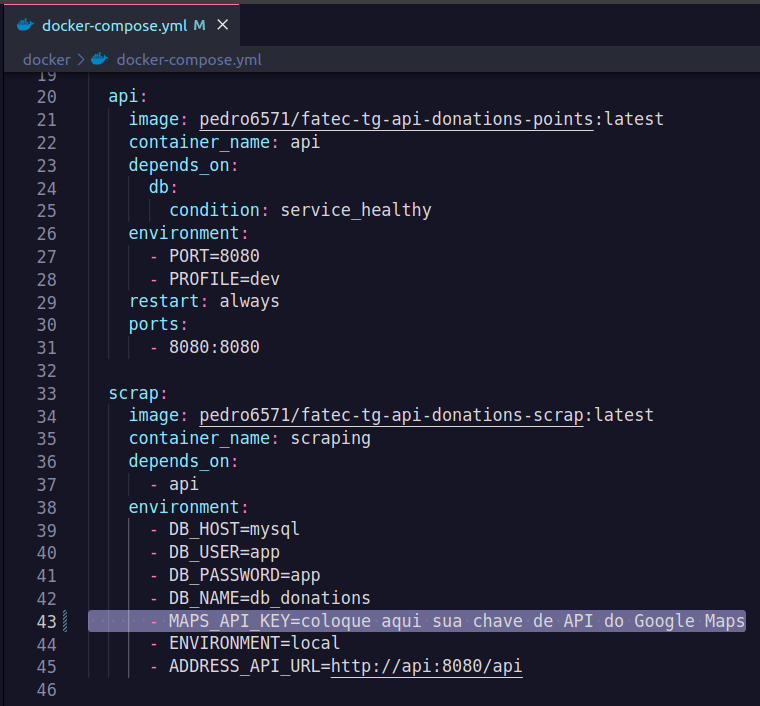
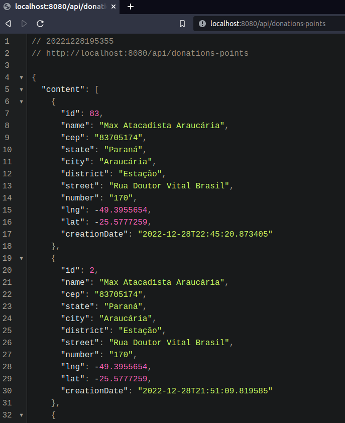

# Donations Points Scraping

Sistema que faz o processo de **Web Scraping** de pontos de coleta de agasalhos para doação. Os dados coletados são tratados e enviados para a [API Donations Points](https://github.com/PedroHPAlmeida/fatec-tg-api-donations-points) para serem consumidos por quaisquer aplicações front-end.

O objetivo destas duas aplicações em conjunto é fazer um "compilado" de pontos de coleta de agasalhos, independente de instituições. Deixando as informações centralizadas em um único lugar e permitindo a fácil consulta.

Atualmente o processo de Web Scraping coleta dados do site do [Exército da Salvação](https://www.exercitodoacoes.org.br/doacoes/pontos-de-coleta/). Futuramente serão introduzidos dados de outros sites.

______
## Tecnologias utilizadas

* Python 3.8 para desenvolvimento da aplicação;
* API do Google Maps para solicitar e salvar os endereços de forma consistente;
* Banco de dados MySQL para salvar os dados extraídos pelo processo de Web Scraping;
* Biblioteca Selenium para fazer o processo de Web Scraping no navegador;
* Biblioteca Beautiful Soup para tratar o HTML;
* Biblioteca Nox para automação de Lint;
* Docker para conteinerizar a aplicação e o banco de dados facilitando o desenvolvimento local;
* Docker Compose para subir os múltiplos conteiners da aplicação (conteiner da aplicação, da API e do banco);
* GitHub Actions para CI:
    - Automação de Lint da aplicação.
    - Atualização automática da imagem docker da aplicação no repositório do [DockerHub Repository - Pedro](https://hub.docker.com/repository/docker/pedro6571/fatec-tg-api-donations-scrap);

______
## Pré-requisitos para executar o projeto

* Docker version 20.10.22
* Docker Compose v2.6.0

______
## Como executar o projeto

1. Entre na pasta **docker** e abra o arquivo ```docker-compose.yml```. Adicione a sua chave de API do Google Maps no local em destaque ([veja aqui](https://developers.google.com/maps/documentation/javascript/get-api-key) como solicitar):

<div align="center">



</div>

2. A partir do terminal entre na pasta **docker** e execute o seguinte comando para subir a aplicação:

```bash
cd docker
docker compose up -d
```

Este comando executa primeiro o banco de dados MySQL, depois a API Spring e por último o container que faz o processo de Web Scraping.

3. Para testar os dados finais que foram salvos na API utilize o seguinte comando no terminal:

```bash
curl --location --request GET 'localhost:8080/api/donations-points'
```

Para uma melhor visualização dos dados faça a requisição pelo Postman, ou instale a extenção [Json Viewer](https://chrome.google.com/webstore/detail/json-viewer/gbmdgpbipfallnflgajpaliibnhdgobh) em seu navegador e cole a url na barra de de pesquisa:

<div align="center">



</div>

______
## Problemas e possíveis soluções

***Conflito de portas do MySQL***

Se o MySQL estiver instalado em sua máquina, certifique-se de desativar o serviço. O docker-compose da aplicação sobe um container que executa o MySQL na porta 3306, caso já exista um serviço executando na mesma porta ocorrerá um erro.
______
