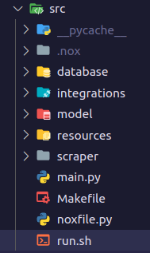
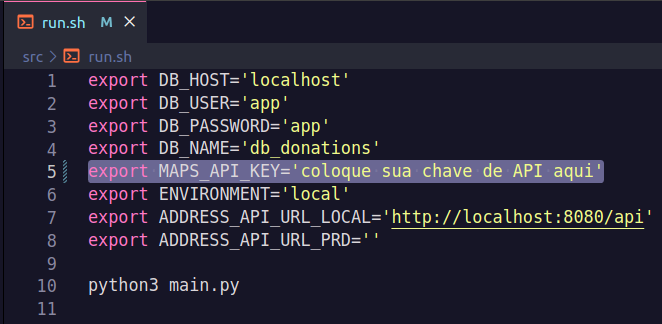
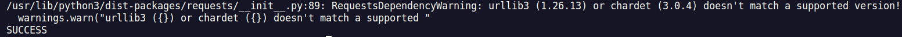
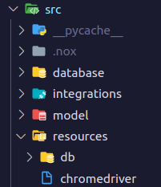

# Donations Points Scraping

Sistema que faz o processo de **Web Scraping** de pontos de coleta de agasalhos para doação. Os dados coletados são tratados e enviados para a [API Donations Points](https://github.com/PedroHPAlmeida/fatec-tg-api-donations-points) para serem consumidos por quaisquer aplicações front-end.

O objetivo destas duas aplicações em conjunto é fazer um "compilado" de pontos de coleta de agasalhos, independente de instituições. Deixando as informações centralizadas em um único lugar e permitindo a fácil consulta.

Atualmente o processo de Web Scraping coleta dados do site do [Exército da Salvação](https://www.exercitodoacoes.org.br/doacoes/pontos-de-coleta/). Futuramente serão introduzidos dados de outros sites.

______
## Tecnologias utilizadas

* Python 3.8 para desenvolvimento da aplicação;
* API do Google Maps para solicitar e salvar os endereços de forma consistente;
* Banco de dados MySQL para salvar os dados extraídos pelo processo de Web Scraping;
* Biblioteca Selenium para fazer o processo de Web Scraping no navegador;
* Biblioteca Beautiful Soup para tratar o HTML;
* Biblioteca Nox para automação de Lint;
* GitHub Actions para CI:
    - Automação de Lint da aplicação.

______
## Como executar o projeto

1. Entre na pasta **docker** e execute o seguinte comando para subir o banco de dados onde serão armazenados os dados coletados no processo de Web Scraping:

```bash
cd docker
docker compose up -d
```

2. Entre na pasta **src** e abra o arquivo ```run.sh```:

<div align="center">



</div>

3. Adicione a sua chave de API do Google Maps ([veja aqui](https://developers.google.com/maps/documentation/javascript/get-api-key) como solicitar):

<div align="center">



</div>

4. Certifique-se que a aplicação [API Donations Points](https://github.com/PedroHPAlmeida/fatec-tg-api-donations-points) está em execução ([veja aqui](https://github.com/PedroHPAlmeida/fatec-tg-api-donations-points/blob/master/README.md) como clonar e executar a API).

5. Entre na ```src``` a partir do terminal:

```bash
cd src/
```

6. Execute o seguinte comando para iniciar a aplicação:
```bash
sh run.sh
```

A seguinte saída deve aparecer no console:



A mensagem de warning é esperada, não se preocupe.

7. Para testar os dados finais que foram salvos na API utilize o seguinte comando no terminal:

```bash
curl --location --request GET 'localhost:8080/api/donations-points'
```

Para uma melhor visualização dos dados faça a requisição pelo Postman, ou instale a extenção [Json Viewer](https://chrome.google.com/webstore/detail/json-viewer/gbmdgpbipfallnflgajpaliibnhdgobh) em seu navegador e cole a url na barra de de pesquisa:

<div align="center">


</div>

______
## Problemas e possíveis soluções

***Conflito de portas do MySQL***

Se o MySQL estiver instalado em sua máquina, certifique-se de desativar o serviço. O docker-compose da aplicação sobe um container que executa o MySQL na porta 3306, caso já exista um serviço executando na mesma porta ocorrerá um erro.

***Erro relacionado a versão do Web Driver***

O processo de Web Scraping necessita do driver do navegador Google Chrome para funcionar, este driver está na pasta ```src/resources/```:

<div align="center">



</div>

Caso a versão do driver seja incompatível com o navegador instalado na máquina ocorrerá um erro.

Para resolver esse problema acesse o site [Chrome Driver](https://chromedriver.chromium.org/downloads) e baixe o driver compatível com a versão do seu navegador e sistema operacional. Por fim, substitua o arquivo na pasta ```src/resources/```.
______
